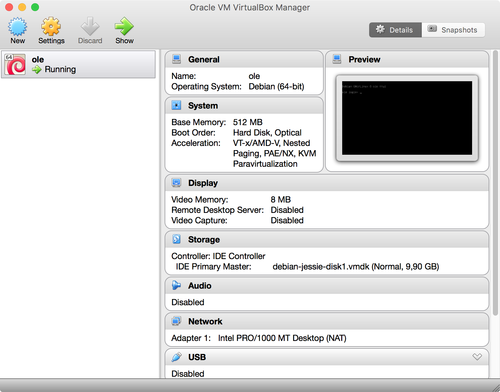

## Porting HTML App to CouchApp

Prerequisites:

* [Couchapp](#couchapp-installation)
* [Couchdb Instance](#couchdb-instance)
* Desired JavaScript/HTML application


### Couchapp Installation
Clone the [couchapp repository](https://github.com/couchapp/couchapp.git), build and install it. With the following commands (from a terminal):

```
git clone https://github.com/couchapp/couchapp.git 
cd couchapp
python setup.py build
sudo python setup.py install
```

### Couchdb Instance
For this we will be using a pre-configured virtual machine with `couchdb instance`

Requirements:

* [VirtualBox](https://www.virtualbox.org/wiki/Downloads)
* [Vagrantup](https://www.vagrantup.com/downloads.html)
* [Vagrant config repo](https://github.com/dogi/ole--vagrant-bells)

Once you have installed the Virtual Box and Vagrantup. You will have to clone the Vagrant config repo like so:

```
git clone https://github.com/dogi/ole--vagrant-bells/ vagrant-vm
cd vagrant-vm/release
```

In the file `Vagrantfile`, You will need to add the line `config.vm.box_version = "8.2.1"` after the line `config.vm.hostname = "ole"`.

#### Turn on the vagrant instance/Virtual Machine
```
vagrant up
```

You should be able to see the virtual machine on virtualbox once the script from the above command finishes:

Also you should be able to access [http://127.0.0.1:5985/](http://127.0.0.1:5985/) and get an output like:
(all in one line)

```
{
   "couchdb":"Welcome",
   "uuid":"e6da0e32f981846e88ff0d817e0d07bc",
   "version":"1.6.1",
   "vendor":{
      "name":"The Apache Software Foundation",
      "version":"1.6.1"
   }
}
```

### Generating the couchapp
Using `couchapp generate` command you will be able to generate the structure of a couchapp:
`couchapp generate test2`

In this case I will generate the app called *"test2"*

```
$ couchapp generate test2
2016-01-16 16:14:16 [INFO] /Users/ignacio/test2 generated.
```

The folder `test2 ~~(appname)~~` will be created.

After you run it, you will need to edit the file `.couchapprc` in order to add the server path.

The file should be like the one shown below. In this file, `db` is the server path, in my case it is `http://127.0.0.1:5985`, followed by `myapp`. Where `myapp` is the database where I want to insert the app.

```
{ 
    "env" : {
        "myserver" : {
            "db" : "http://127.0.0.1:5985/myapp"
        } 
    }
}
```

Also you can edit some fields, like `name` and `description`  in the file `couchapp.json`

```
{
    "name": "Test app",
    "description": "Testing couchapps"
}
```

### Adding content to the app and pushing it
Now that you have generated the app, you will need to add the original app data ~~(the one you're porting)~~ to `_attachments` folder. You may want to remove everything inside that folder before you add the new content. You can remove all items inside it and copy the data with the following terminal commands:

```
rm -rf _attachments/*
cp -r /home/user/myoriginalapp/* _attachments/
```

Now that you have done all those steps, you will need to upload the app to the server:<br>
`couchapp push myserver`<br>where `myserver` is the one you specified in the `.couchapprc` file.

```
$ couchapp push myserver
2016-01-16 16:16:24 [INFO] Visit your CouchApp here:
http://127.0.0.1:5985/myapp/_design/test2/index.html
```

After this, The app will be available on the specified link. You should be able to see the database in http://127.0.0.1:5985/_utils/database.html?myapp
